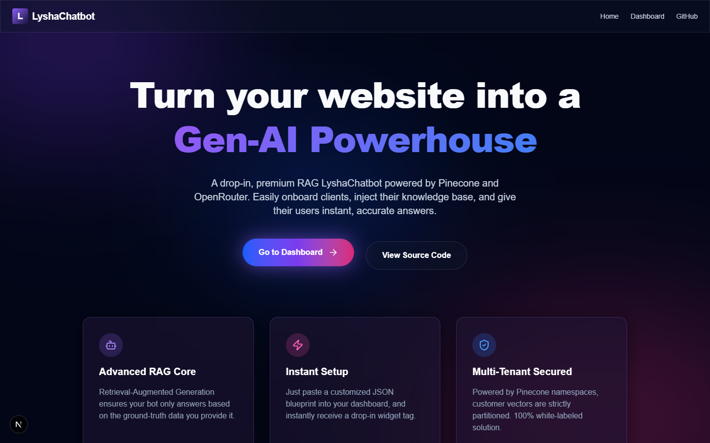
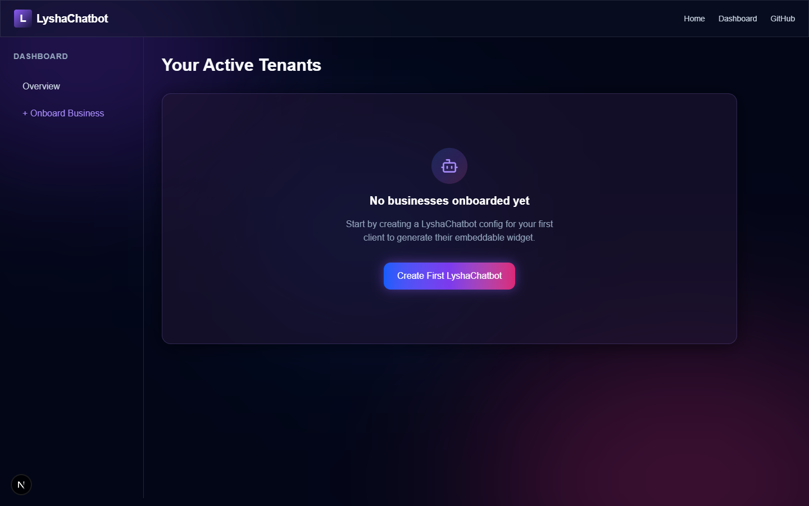
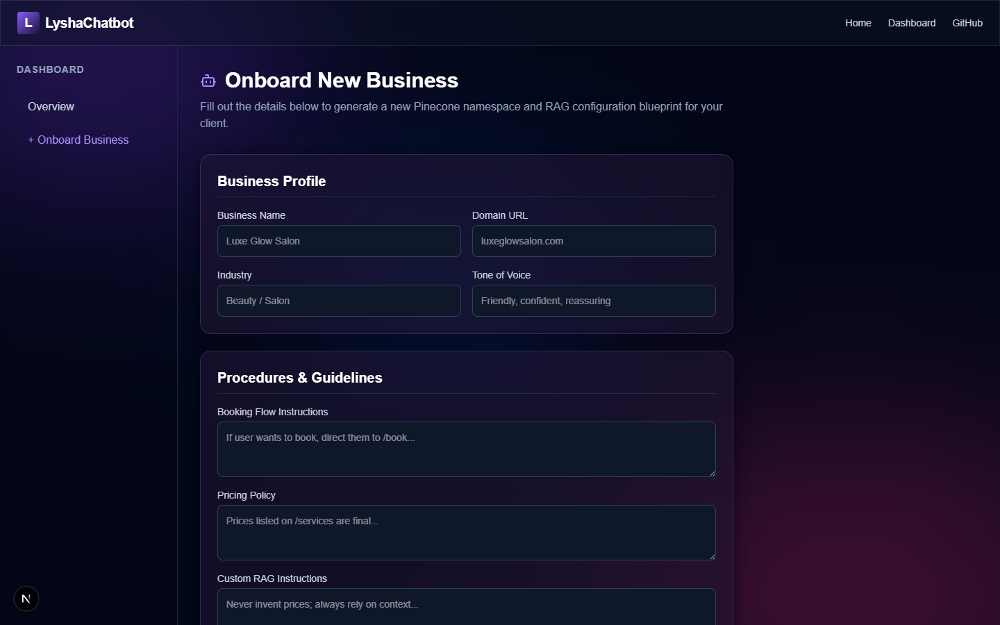

# LyshaChatbot SaaS Platform

A multi-tenant, SaaS-ready platform for providing businesses with RAG-powered LyshaChatbots. This solution allows a business to inject business-specific knowledge via Pinecone vector embeddings and uses OpenRouter (e.g. GPT-4o-mini) to serve an intelligent floating chat widget to their site visitors.

Built with Next.js, TailwindCSS, Pinecone, and OpenRouter.

## Features

- **Multi-Tenant Architecture**: Isolate business data into Pinecone namespaces (e.g., `site_luxeglowsalon_com`).
- **Dynamic Configuration**: A JSON-based configuration model for each business detailing their tone of voice, procedures, FAQ, UI preferences, and RAG Pipeline settings.
- **RAG Core**: Automatic embedding generation using OpenRouter's API, upserting into the Pinecone index, and high-accuracy context retrieval.
- **Chat Widget**: A beautifully designed, drop-in snippet (`<script>`) that works on any external site, fully customizable.
- **Onboarding Dashboard**: A premium purple-themed Next.js UI for creating new chatbot instances for clients.

## Getting Started

1. Clone the repository.
2. Run \`npm install\`.
3. Create a \`.env.local\` file based on the environment variables defined below.
4. Run \`npm run dev\` to start the server.

### Environment Variables

\`\`\`env
PINECONE_API_KEY=your_pinecone_key
PINECONE_INDEX_NAME=websites-index
OPENROUTER_API_KEY=your_openrouter_key
OPENROUTER_BASE_URL=https://openrouter.ai/api/v1
EMBEDDING_MODEL=openai/text-embedding-3-small
CHAT_MODEL=openai/gpt-4o-mini
\`\`\`

## Architecture

- **\`/src/app/api/chat/route.ts\`**: The endpoint that the embedded widget communicates with.
- **\`/src/lib/rag/\`**: Pinecone and OpenRouter interaction logic context retrieval.
- **\`/src/types/chatbot.ts\`**: High-fidelity TS Schemas for the JSON spec provided by Antigravity templates.

## License

This project is licensed under the MIT License - see the LICENSE file for details.
